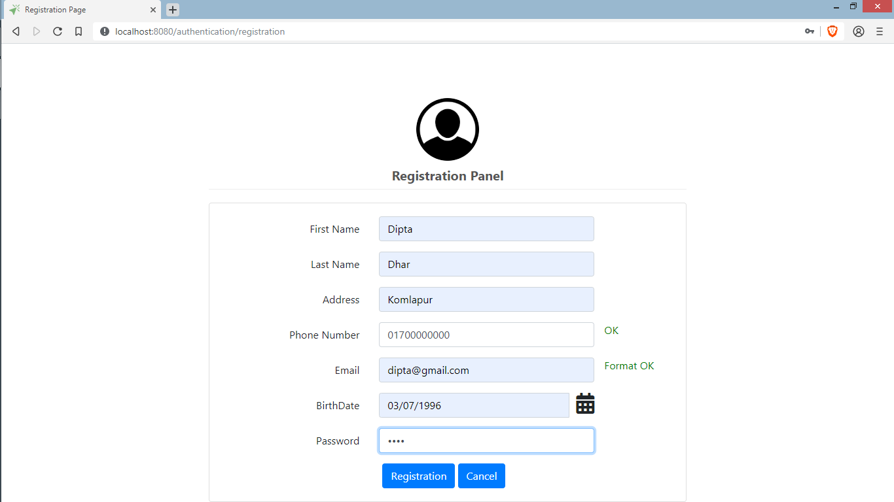
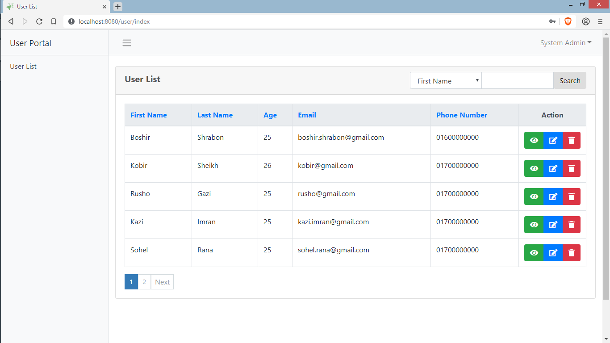
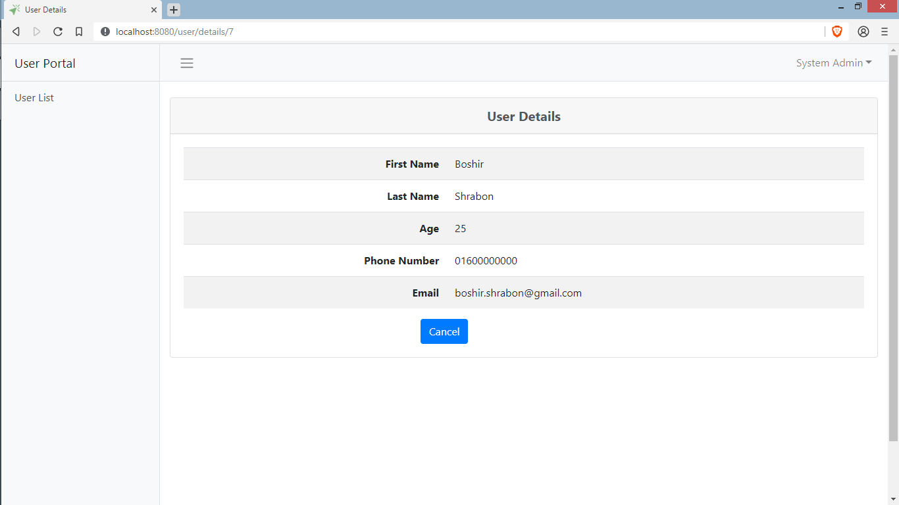
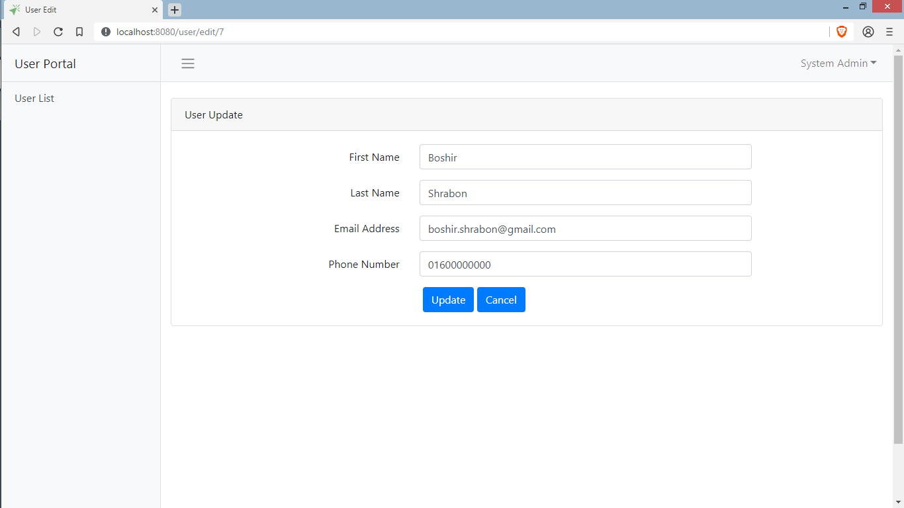
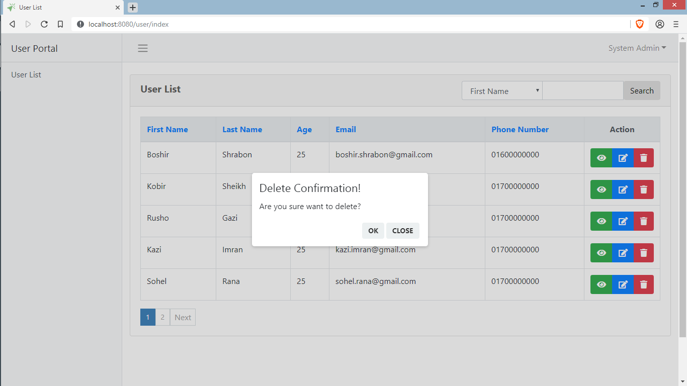
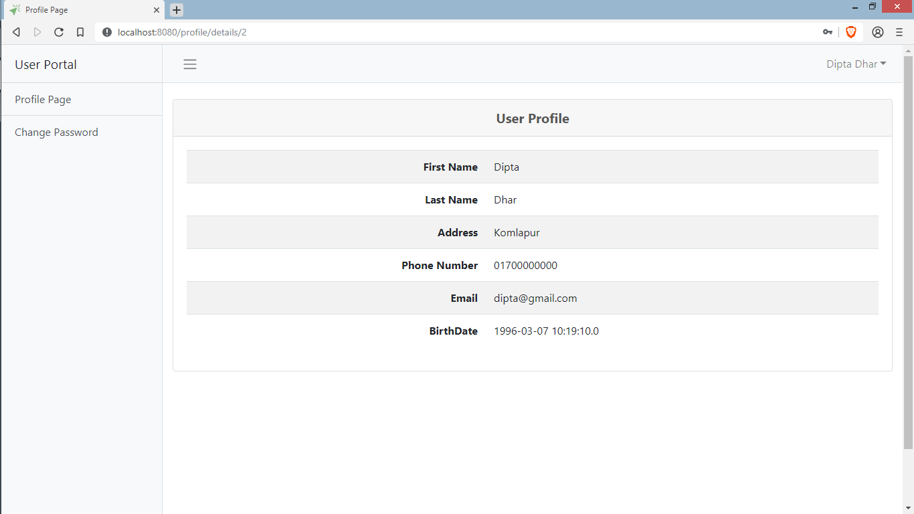
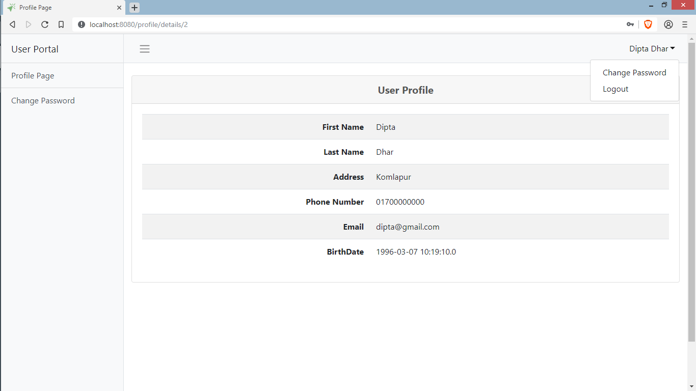
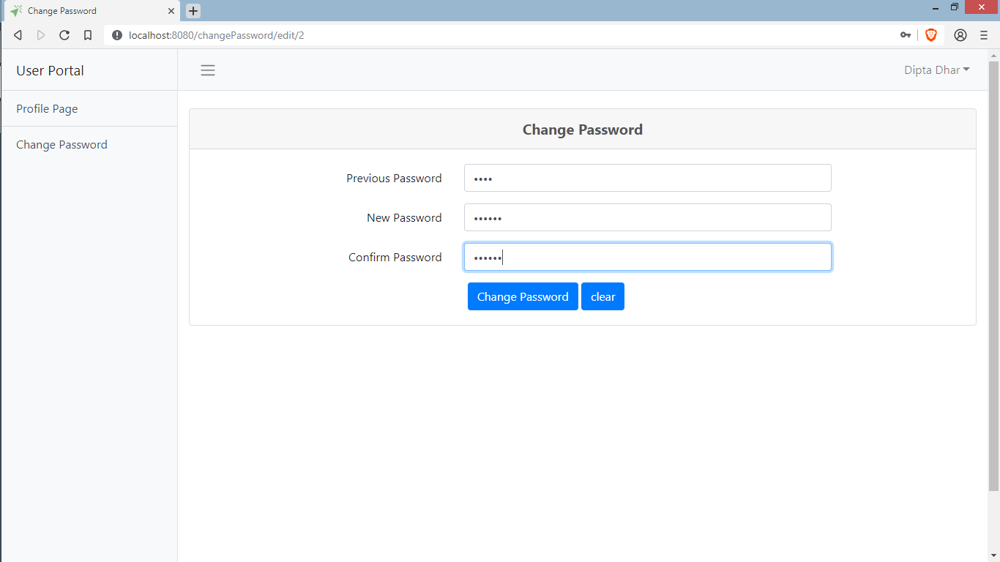

# UserPortal
Simple User Portal that  save, delete & update user important information. It is build using Grails, Bootstrap 4, jQuery, & MySQL database.

## Login:

## Registration:

## Admin:

### Index:

### User Details:

### Edit User:

### Delete User:

## Normal User:

### User Details:

### User Change Password(pop up):

### User Change Password:

Specials Thanks: H.M.Touhid Mia
