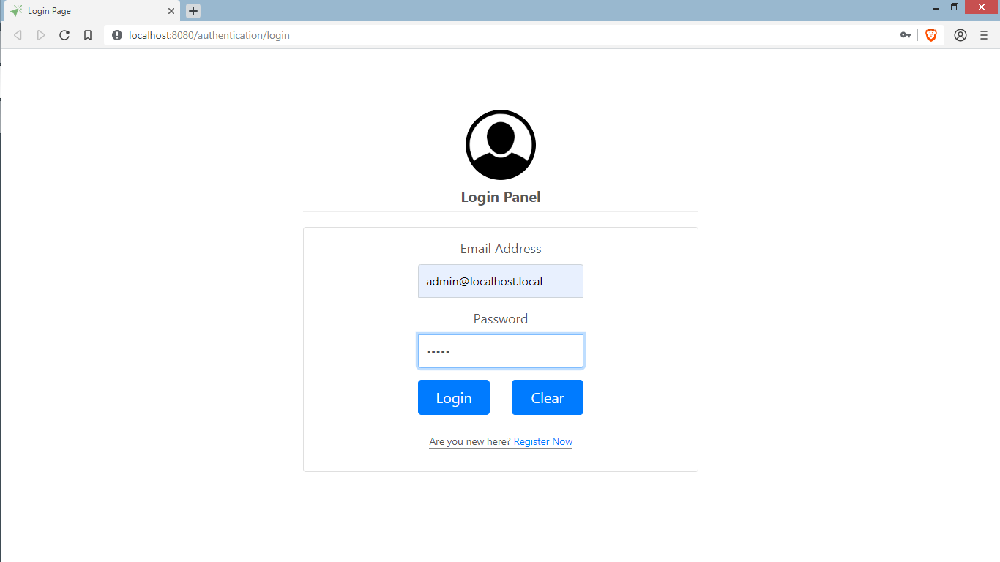

# UserPortal
Simple User Portal that  save, delete & update user important information. It is build using Grails, Bootstrap 4, jQuery, & MySQL database.

## Login:

## Registration:

## Admin Panel:

### Index:

### User Details:

### Edit User:

### Delete User:

## User Panel:

### User Details:

### Change Password(pop up):

### Change Password:

Specials Thanks: H.M.Touhid Mia
